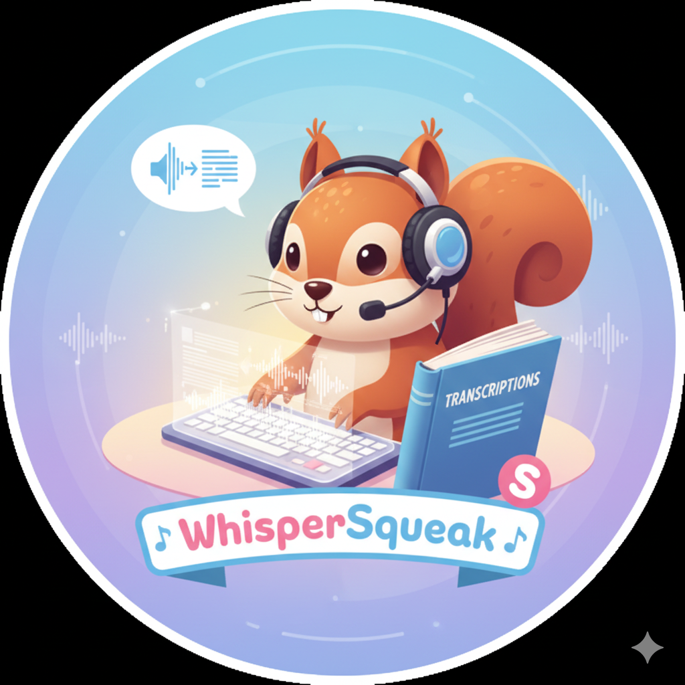

# WhisperSqueak



A Telegram bot for audio transcription using [Faster Whisper Server](https://github.com/fedirz/faster-whisper-server).

## Features

- Transcribe voice messages and audio files (MP3, WAV, OGG, M4A, FLAC, etc.)
- Dynamic model selection from your Faster Whisper Server
- Multi-language support with 99+ languages and auto-detection
- Persistent user settings (model & language preferences)
- User whitelist for access control

## Requirements

- Docker
- A running [Faster Whisper Server](https://github.com/fedirz/faster-whisper-server) instance
- Telegram Bot Token (from [@BotFather](https://t.me/BotFather))

## Quick Start

1. **Clone the repository**
   ```bash
   git clone https://github.com/yourusername/WhisperSqueak.git
   cd WhisperSqueak
   ```

2. **Configure environment**
   ```bash
   cp .env.example .env
   # Edit .env with your settings
   ```

3. **Build and run**
   ```bash
   docker build -t whispersqueak .
   docker run -d --name whispersqueak \
     --env-file .env \
     -v ./data:/app/data \
     -e SETTINGS_FILE=/app/data/user_settings.json \
     whispersqueak
   ```

## Configuration

Create a `.env` file with the following variables:

| Variable | Required | Default | Description |
|----------|----------|---------|-------------|
| `TELEGRAM_TOKEN` | Yes | - | Bot token from @BotFather |
| `ALLOWED_UIDS` | Yes | - | Comma-separated Telegram user IDs |
| `WHISPER_URL` | No | `http://host.docker.internal:18000/v1` | Faster Whisper Server URL |
| `WHISPER_API_KEY` | No | `dummy` | API key (if server requires auth) |
| `SETTINGS_FILE` | No | `/app/user_settings.json` | Path for persistent settings |

### Getting Your Telegram User ID

1. Message [@userinfobot](https://t.me/userinfobot) on Telegram
2. It will reply with your user ID
3. Add this ID to `ALLOWED_UIDS` in your `.env` file

## Bot Commands

| Command | Description |
|---------|-------------|
| `/start` | Welcome message and current settings |
| `/model` | Select transcription model |
| `/language` | Select input language (or auto-detect) |
| `/help` | Usage guide and tips |

## Usage

1. Send `/model` to select a Whisper model (default: `faster-whisper-large-v3`)
2. Send `/language` to set input language (default: auto-detect)
3. Send a voice message or audio file
4. Receive the transcription

## Architecture Decisions

### Model Selection
- Models are fetched dynamically from the Faster Whisper Server's `/v1/models` endpoint
- Only popular/common models are shown in the selection menu to avoid Telegram's button limits
- Popular models include: large-v3, medium, small, base, tiny, and turbo variants

### Language Support
- Supports all 99+ languages that Whisper supports
- Auto-detect is the default and works well for most use cases
- Setting a specific language can improve accuracy for that language

### Persistence
- User settings (model, language) are stored in a JSON file
- Mount a volume to `/app/data` to persist across container restarts

### Audio Processing
- All audio formats are converted to MP3 using FFmpeg/pydub before sending to Whisper
- Supports: MP3, WAV, OGG, M4A, FLAC, AAC, WMA, OPUS, and more

## Known Limitations

### No Streaming Transcription
The OpenAI-compatible API used by Faster Whisper Server does not support true word-by-word streaming for transcription. The bot waits for the complete transcription before displaying results.

**Why?** The OpenAI Audio Transcription API (`/v1/audio/transcriptions`) returns the full result in one response. Real-time streaming would require Server-Sent Events (SSE) support, which is not part of the standard API.

### Telegram Message Limits
- Maximum message length is 4096 characters
- Long transcriptions are automatically split into multiple messages

### Button Callback Data Limit
- Telegram limits callback data to 64 bytes
- Model names are stored by index to work around this limitation

## Docker Networking

### WSL2 / Docker Desktop
Use `host.docker.internal` to access services on the host:
```
WHISPER_URL=http://host.docker.internal:18000/v1
```

### Linux (native Docker)
Use the Docker gateway IP or host network mode:
```bash
# Option 1: Gateway IP
WHISPER_URL=http://172.17.0.1:18000/v1

# Option 2: Host network
docker run --network host ...
```

## Development

### Local Testing (Python 3.12+)
```bash
# Create virtual environment
uv venv
source .venv/bin/activate

# Install dependencies
uv pip install -r requirements.txt

# For Python 3.13+, also install:
uv pip install audioop-lts

# Run locally
python bot.py
```

### Code Structure
```
WhisperSqueak/
├── bot.py              # Main bot logic
├── Dockerfile          # Container definition
├── requirements.txt    # Python dependencies
├── .env.example        # Environment template
├── .gitignore          # Git ignore rules
└── data/               # Persistent storage (gitignored)
    └── user_settings.json
```

## Troubleshooting

### Bot not responding
- Check logs: `docker logs whispersqueak`
- Verify `TELEGRAM_TOKEN` is correct
- Ensure your user ID is in `ALLOWED_UIDS`

### "No models available"
- Verify Faster Whisper Server is running
- Check `WHISPER_URL` is accessible from the container
- For WSL2, ensure `host.docker.internal` resolves correctly

### Audio not processing
- Check logs for error messages
- Ensure FFmpeg is installed (included in Docker image)
- Verify the file is a supported audio format

## License

MIT License - See [LICENSE](LICENSE) for details.

## Contributing

Contributions are welcome! Please open an issue or submit a pull request.

## Credits

- [Faster Whisper Server](https://github.com/fedirz/faster-whisper-server) - OpenAI-compatible Whisper API
- [aiogram](https://github.com/aiogram/aiogram) - Telegram Bot framework
- [OpenAI Whisper](https://github.com/openai/whisper) - Speech recognition model
